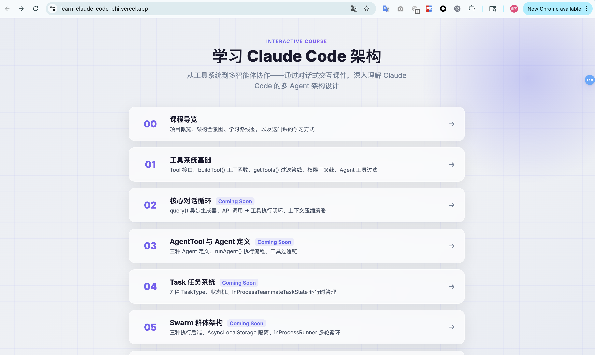
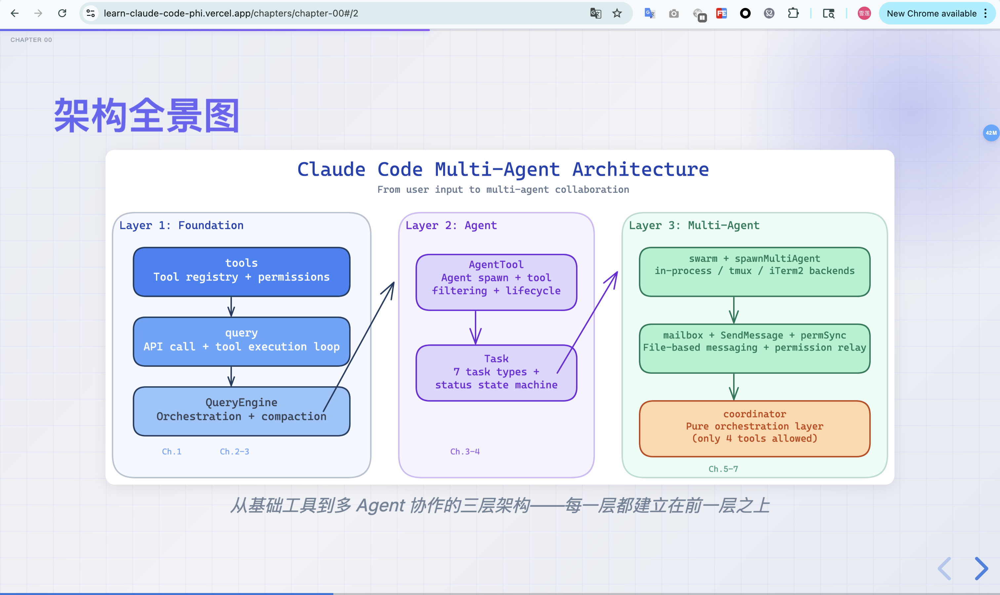

# codebase-slideshow

> Turn any codebase into a beautiful, interactive slideshow course — powered by [Claude Code](https://claude.ai/code) skills.

[](LICENSE)
[](https://docs.anthropic.com/en/docs/claude-code)

A Claude Code skill that **automatically generates glassmorphism reveal.js presentations** for any codebase — complete with dialogue-driven narrative, real code walkthroughs, architecture diagrams, interactive quizzes, and adaptive difficulty.

## Demo

Here's a course generated for the [Claude Code](https://github.com/anthropics/claude-code) source code:

**[Live demo](https://learn-claude-code-phi.vercel.app)**

| Course Index | Architecture Diagram | Dialogue Slide |
|:---:|:---:|:---:|
|  |  |  |

## Features

- **Glassmorphism UI** — Frosted glass panels, gradient accents, micro-animations
- **Dialogue-driven narrative** — Two characters (Newbie + Senior Architect) explore the code together in a chat-bubble layout
- **Real code walkthroughs** — Side-by-side code + explanation, every snippet pulled from the actual codebase
- **Architecture diagrams** — Mermaid flowcharts for inline scenarios; Excalidraw rendered PNGs for complex architectures
- **Interactive quizzes** — Multiple choice + short answer with reference answers and explanations
- **Adaptive difficulty** — Quiz scores drive difficulty adjustments in later chapters
- **Multi-language** — English, 中文, 日本語, or any custom language
- **Light / Dark theme** — Automatic theme switching with matching code highlighting
- **Editable drafts** — Markdown lesson plans you can tweak before HTML generation

## Quick Start

### 1. Install the skill

```bash
# From your project root
mkdir -p .claude/skills
git clone https://github.com/ShellyDeng08/codebase-slideshow.git .claude/skills/codebase-slideshow
```

### 2. (Optional) Enable Excalidraw diagrams

```bash
# Install uv if you don't have it
curl -LsSf https://astral.sh/uv/install.sh | sh

# Set up the renderer
cd .claude/skills/codebase-slideshow/excalidraw
uv sync
uv run playwright install chromium
```

Without this, the skill falls back to Mermaid diagrams (still good, just less polished for complex architectures).

### 3. Run it

In Claude Code, just say:

```
Teach me this codebase
```

The skill will ask about your language, teaching style, tech level, learning goal, theme, and depth — then generate and serve chapters one by one in your browser.

## How It Works

```
.learn/                     ← Generated in your project root
├── preferences.json        ← Your settings
├── codebase-profile.json   ← Codebase analysis
├── syllabus.json           ← Chapter plan
├── styles.css              ← Slide styles
├── chapters/
│   ├── chapter-00.html     ← Course overview
│   ├── chapter-01.html     ← First chapter
│   └── ...
├── diagrams/
│   ├── chapter-00-panorama.png
│   └── ...
├── drafts/
│   ├── chapter-01.md       ← Lesson plan (editable!)
│   └── ...
└── reports/
    ├── chapter-01.json     ← Quiz results & feedback
    └── ...
```

**Drafts are editable** — adjust a markdown lesson plan, then ask Claude to regenerate the HTML. No need to re-read source code.

## Customization

| What to change | File |
|---|---|
| Visual theme (colors, glass effects, animations) | `references/styles.css` |
| Slide HTML template | `references/template-base.html` |
| Diagram color palette | `excalidraw/color-palette.md` |

## Prerequisites

- [Claude Code](https://claude.ai/code) CLI
- Python 3 (for the local presentation server — no pip install needed)

## License

MIT
